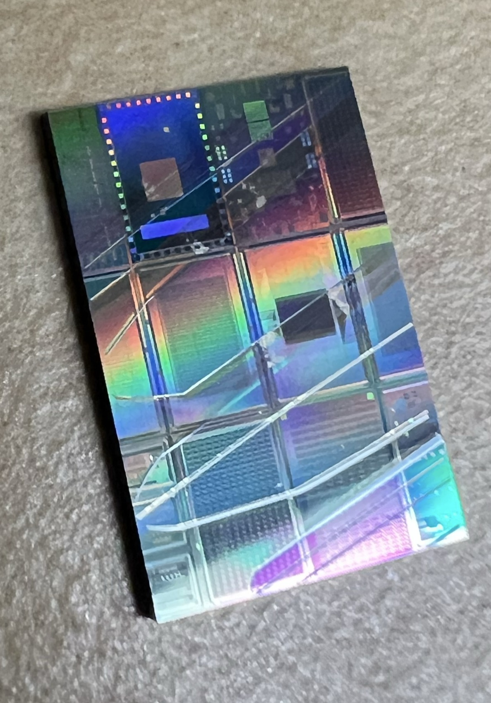
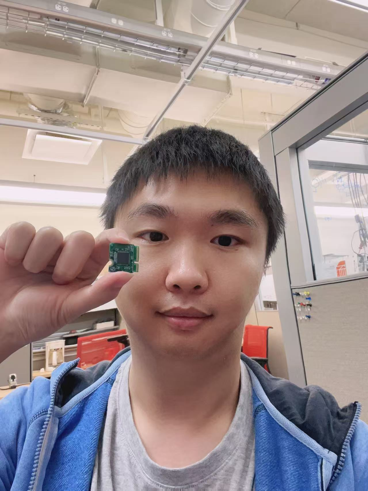
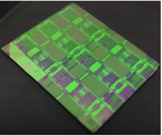
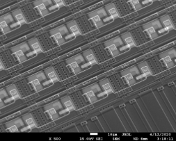
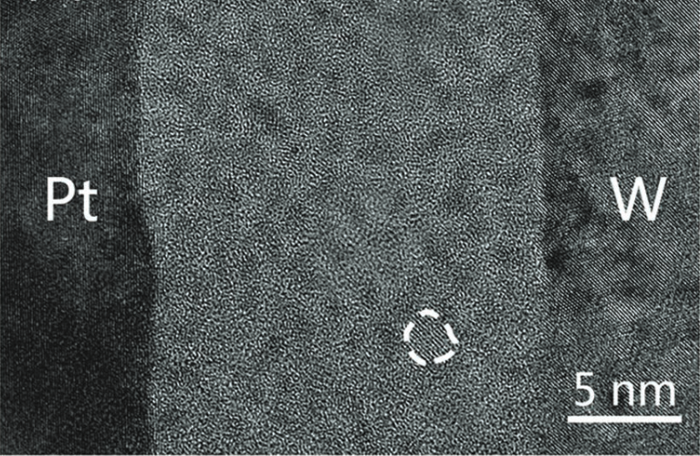
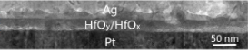

# The chips showing below are what I designed/fabricated mainly

## NIST Emerging Device Integration Project (SKY130)

The chips were sent back from SKY130 MPW🎉🎉🎉!

## Five Guys Chip (GF180)

<!--img src="/images/chip_180.jpg"-->
<!--img src="/images/chip_180.jpg" style="max-height: 50px; max-width: 50px;" /-->

The chips were sent back from Efabless MPW shuttle 🎉🎉🎉!

## AI Accelerator
<!--img src="/images/memristor_accel.png" width="300" height="400"-->

The chips were successfully made in the clean room 🎉🎉🎉!

# Are you curious aboout the micro/nano-scale structure of the chip? Here are the images!

## 1-transistor-1-resistive-memory (1T1R) array

## Pt/HfOx/HfOy/W device cross-section

## Pt/HfOx/HfOy/Ag device cross-section

